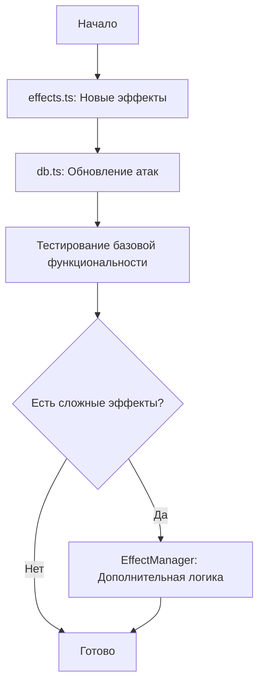

# Финальный план редактирования атак и эффектов

## Краткое описание
План включает все изменения атак и эффектов для 8 классов (Воин, Маг, Лучник, Целитель, Ассасин, Паладин, Друид, Алхимик) согласно требованиям пользователя.

## Ключевые изменения

### 1. Новые эффекты (9 штук)
- **ПОВЫШЕНИЕ_УРОНА** (модификация STRENGTH) - +25% урона, 1 ход
- **ОПУСТОШЕНИЕ** - скрытие HP противника на 3 хода
- **БЕРСЕРК** - замена всех атак, самоповреждение 35, HP максимум 100
- **КОРРОЗИЯ** - -15% урона, +15% получаемого урона, стакается
- **КРЫЛАТЫЙ_СОЮЗНИК** - +20 к урону, +25 к исцелению
- **АРКАНА** - восстанавливает использование "Арканного выстрела"
- **МЕДВЕДЬ** - замена атак на медвежьи
- **ОЧИЩЕНИЕ** - снимает все эффекты с шансом 65%
- **ВОСКРЕШЕНИЕ** - возрождение с 55 HP при смерти

### 2. Модификации существующих эффектов
- **BURNING** - обновить параметры урона
- **POISON** - увеличить урон с 3 до 6
- **SLOW** - настроить снижение энергии
- **SHIELD** - обновить значения щитов
- **STRENGTH** → переименовать в "Повышение урона"

### 3. Изменения атак по классам
- **Воин**: Берсерк с самоповреждением, улучшение Удара щитом, Рывка и др.
- **Маг**: баланс использований, новые эффекты Опустошение и Аркана
- **Лучник**: особенности "Один выстрел", Крылатый союзник
- **Целитель**: новые эффекты очищения и воскрешения
- **Ассасин**: механика стаков отравления/кровотечения
- **Паладин**: усиление ультимейтов, удаление слабых атак
- **Друид**: случайный призыв зверя, форма медведя
- **Алхимик**: эффект Коррозия на всех атаках, переименование ультимейтов

## Файлы для редактирования

### Приоритет 1: `src/data/effects.ts`
- Добавить 9 новых эффектов
- Модифицировать 5 существующих эффектов

### Приоритет 2: `src/db.ts`
- Обновить ~150 атак (параметры damage, uses, energyGain/Cost, appliedEffects)
- Удалить ~15 ненужных атак
- Добавить новые эффекты к соответствующим атакам

### Приоритет 3: `src/effects/EffectManager.ts` (опционально)
- Добавить логику для сложных эффектов (Берсерк, Медведь, Аркана)

## Оценка сложности
- **Низкая**: Изменение числовых параметров (damage, uses, energy)
- **Средняя**: Добавление новых эффектов с простой логикой
- **Высокая**: Эффекты, требующие изменения логики боя (Берсерк, Медведь, "Один выстрел")

## Рекомендации по реализации

### Фаза 1: Подготовка
1. Создать backup текущих файлов
2. Создать ветку git для изменений

### Фаза 2: Реализация эффектов
1. Модифицировать `effects.ts` - добавить новые эффекты
2. Протестировать, что эффекты загружаются без ошибок

### Фаза 3: Реализация атак
1. Обновить `db.ts` - начать с одного класса (например, Воин)
2. После каждого класса тестировать, что игра запускается
3. Продолжить с остальными классами

### Фаза 4: Сложная логика (если требуется)
1. Реализовать обработку сложных эффектов в EffectManager
2. Добавить UI-поддержку для новых эффектов

## Диаграмма зависимостей

## Следующие шаги

1. **Утвердить план** - проверить, что все требования учтены
2. **Переключиться в режим Code** для начала реализации
3. **Реализовать поэтапно** - начать с effects.ts, затем db.ts
4. **Тестировать после каждого этапа** - убедиться, что игра работает

## Вопросы для уточнения
1. Нужно ли реализовывать сложную логику эффектов (Берсерк, Медведь) сразу, или можно оставить их как placeholder?
2. Требуется ли поддержка стаков эффектов "Коррозия" в текущей системе?
3. Как обрабатывать эффект "Один выстрел" (10% шанс 300 урона) - через модификатор или отдельную логику?

---

**Готов к реализации после утверждения плана.**