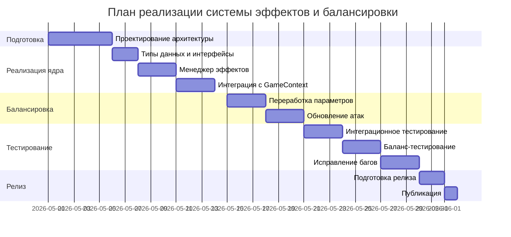

# Финальный план реализации системы эффектов и балансировки RPG Arena

**Дата создания:** 29 апреля 2026  
**Версия:** 1.0  
**Статус:** Утверждён

## Содержание
1. [Часть 1: Обзор и цели](#часть-1-обзор-и-цели)
2. [Часть 2: Архитектурные изменения](#часть-2-архитектурные-изменения)
3. [Часть 3: Реализация системы эффектов (Вариант 2)](#часть-3-реализация-системы-эффектов-вариант-2)
4. [Часть 4: Балансировка игры (Вариант B)](#часть-4-балансировка-игры-вариант-b)
5. [Часть 5: План работ по этапам](#часть-5-план-работ-по-этапам)
6. [Часть 6: Риски и митигация](#часть-6-риски-и-митигация)
7. [Часть 7: Критерии приёмки](#часть-7-критерии-приёмки)

---

## Часть 1: Обзор и цели

### Текущее состояние
Проект RPG Arena представляет собой браузерную пошаговую RPG с боями между двумя игроками (PvP) или игроком и ИИ (PvC). Имеется 8 классов персонажей, каждый с 10 атаками (включая ультимейты). Базовая механика включает HP, энергию (единый ресурс), использование атак с ограниченным количеством применений и накопление энергии для ультимейтов.

**Ограничения текущей системы:**
- Отсутствие системы эффектов (баффы/дебаффы)
- Однообразный геймплей (все классы используют одинаковую механику ресурса)
- Дисбаланс между классами (некоторые классы сильнее других)
- Низкая реиграбельность из-за ограниченного стратегического разнообразия

### Цели реализации
1. **Внедрить расширенную систему эффектов** (Вариант 2) с поддержкой:
   - Баффов и дебаффов с модификаторами
   - Щитов, периодического урона/лечения (DoT/HoT)
   - Контрольных эффектов (оглушение, замедление)
   - Стаков и приоритетов
   - Визуализации эффектов в интерфейсе

2. **Провести агрессивный ребаланс** (Вариант B) для:
   - Введения уникальных ресурсов для каждого класса
   - Переработки HP и параметров персонажей
   - Создания разнообразных атак с синергией эффектов
   - Формирования меты с контр-пиками и несколькими стратегиями

3. **Повысить глубину и реиграбельность** игры, сделав бои более стратегическими и непредсказуемыми.

### Критерии успеха
- Система эффектов поддерживает не менее 10 различных типов эффектов
- Не менее 70% атак взаимодействуют с эффектами (накладывают или усиливаются от них)
- Winrate каждого класса в диапазоне 40-60% в пиковых matchups
- Средняя длительность боя 5-10 ходов
- Положительные отзывы тестировщиков о глубине геймплея
- Отсутствие критических багов в логике эффектов

---

## Часть 2: Архитектурные изменения

### Изменения в типах данных (`src/types/game.ts`)

#### 1. Интерфейс `Effect` (расширенный)
```typescript
interface Effect {
  id: string; // уникальный идентификатор
  name: string;
  description: string;
  icon: string; // название иконки для UI
  duration: number; // ходы
  maxStacks?: number; // максимальное количество стаков
  currentStacks: number;
  priority: number; // приоритет применения (0-10)
  type: 'buff' | 'debuff' | 'shield' | 'control' | 'special';
  
  // Модификаторы
  modifiers: {
    damageMultiplier?: number;
    damageReduction?: number;
    healingMultiplier?: number;
    energyGainMultiplier?: number;
    criticalChance?: number;
    dodgeChance?: number;
  };
  
  // Специальные свойства
  dotDamage?: number;
  hotHealing?: number;
  shieldAmount?: number; // величина щита
  isStun?: boolean; // оглушение
  reflectPercent?: number; // процент отражения урона
  
  // Колбэки
  onApply?: (target: Character, source: Character) => void;
  onTurnStart?: (target: Character) => void;
  onTurnEnd?: (target: Character) => void;
  onRemove?: (target: Character) => void;
}
```

#### 2. Интерфейс `Character` (расширение)
```typescript
export interface Character extends CharacterPreset {
  attacks: Attack[];
  effects: Effect[]; // активные эффекты
  shields: number; // текущее значение щитов
  isStunned: boolean; // оглушён ли персонаж
}
```

#### 3. Интерфейс `Attack` (дополнение)
```typescript
export interface Attack {
  // существующие поля...
  appliedEffects?: Effect[]; // эффекты, накладываемые атакой
  effectChance?: number; // шанс применения (0-1)
}
```

#### 4. Новые типы действий в редукторе
```typescript
type GameAction =
  | { type: 'EFFECT_APPLY'; payload: { target: 1 | 2; effect: Effect } }
  | { type: 'EFFECT_TICK'; payload: { target: 1 | 2 } }
  | { type: 'EFFECT_REMOVE'; payload: { target: 1 | 2; effectId: string } }
  | { type: 'CLEANSE'; payload: { target: 1 | 2; effectType?: string } }
  // ... существующие действия
```

### Создание менеджера эффектов (`src/effects/EffectManager.ts`)

**Ответственности:**
- Применение эффектов с учётом приоритетов и стаков
- Обновление длительности эффектов
- Вызов колбэков `onTurnStart`, `onTurnEnd`, `onRemove`
- Управление щитами и контролем (станы)
- Расчёт итоговых модификаторов для персонажа

**Ключевые методы:**
- `applyEffect(target: Character, effect: Effect, source?: Character): void`
- `tickEffects(target: Character): void`
- `calculateModifiers(target: Character): Modifiers`
- `hasEffect(target: Character, effectId: string): boolean`
- `cleanse(target: Character, effectType?: string): void`

### Модификация редуктора `GameContext`

**Изменения в действии `ATTACK`:**
1. Перед расчётом урона проверить, оглушён ли атакующий (пропуск хода)
2. Применить эффекты атаки к цели (с учётом шанса)
3. Рассчитать итоговый урон с учётом модификаторов из активных эффектов
4. Учесть щиты перед вычетом HP
5. Обработать отражение урона
6. После атаки вызвать `onTurnEnd` для атакующего и `onTurnStart` для следующего игрока

**Новые действия:**
- `EFFECT_APPLY` – добавить эффект персонажу
- `EFFECT_TICK` – обновить длительность всех эффектов персонажа
- `EFFECT_REMOVE` – удалить эффект
- `CLEANSE` – снять эффекты определённого типа

### Изменения в данных (`src/db.ts`)

1. **Добавить поле `resourceRules` в `CharacterPreset`:**
```typescript
interface CharacterPreset {
  // существующие поля...
  resourceRules?: {
    generation: 'passive' | 'onDamage' | 'onHeal' | 'onAttack';
    value: number;
    perTurn?: number;
  };
}
```

2. **Создать библиотеку эффектов** как константный объект для повторного использования:
```typescript
export const EFFECTS = {
  BLEEDING: { id: 'bleed', name: 'Кровотечение', type: 'debuff', ... },
  SHIELD: { id: 'shield', name: 'Щит', type: 'shield', ... },
  // ...
};
```

3. **Обновить атаки** с добавлением `appliedEffects` и `effectChance`.

---

## Часть 3: Реализация системы эффектов (Вариант 2)

### Детальный план по шагам

#### Шаг 1: Подготовка типов данных (2 дня)
- Обновить `src/types/game.ts` с новыми интерфейсами
- Создать файл `src/types/effects.ts` для детальных типов эффектов
- Обновить импорты во всём проекте

#### Шаг 2: Создание менеджера эффектов (3 дня)
- Создать `src/effects/EffectManager.ts` с полной реализацией
- Написать unit-тесты для основных сценариев
- Интегрировать менеджер в контекст игры

#### Шаг 3: Модификация редуктора (2 дня)
- Расширить `gameReducer` в `GameContext.tsx` поддержкой эффектов
- Обновить логику действия `ATTACK`
- Добавить новые действия (`EFFECT_APPLY`, `EFFECT_TICK`, `EFFECT_REMOVE`, `CLEANSE`)

#### Шаг 4: Создание библиотеки эффектов (2 дня)
- Определить 10-15 базовых эффектов в `src/data/effects.ts`
- Создать фабрики для создания экземпляров эффектов с кастомными параметрами

#### Шаг 5: Визуализация эффектов в BattleScene (3 дня)
- Создать компонент `EffectIcons.tsx` для отображения иконок эффектов
- Добавить панель эффектов под карточкой персонажа
- Реализовать tooltips с описанием эффектов
- Добавить анимации применения/снятия эффектов
- Интегрировать индикаторы щитов и станов

#### Шаг 6: Обновление данных атак (2 дня)
- Модифицировать `src/db.ts`: добавить `appliedEffects` и `effectChance` к атакам
- Переработать 2-3 атаки для каждого класса с эффектами
- Протестировать взаимодействия

#### Шаг 7: Интеграция и тестирование (3 дня)
- Провести интеграционное тестирование всей системы
- Исправить выявленные баги
- Настроить баланс базовых значений

### Примеры кода для ключевых изменений

#### Пример эффекта "Кровотечение":
```typescript
const BLEEDING_EFFECT: Effect = {
  id: 'bleed',
  name: 'Кровотечение',
  description: 'Наносит 5 урона каждый ход',
  icon: 'bleed',
  duration: 3,
  maxStacks: 3,
  currentStacks: 1,
  priority: 5,
  type: 'debuff',
  dotDamage: 5,
  onTurnEnd: (target) => {
    target.hp -= 5 * this.currentStacks;
  }
};
```

#### Пример атаки с эффектом:
```typescript
{
  name: "Ядовитая стрела",
  damage: 12,
  uses: 5,
  max_uses: 5,
  className: "Лучник",
  energyGain: 25,
  appliedEffects: [BLEEDING_EFFECT],
  effectChance: 0.7 // 70% шанс наложить кровотечение
}
```

### Визуализация эффектов в BattleScene

**Дизайн панели эффектов:**
```
[Иконка] x3 [Таймер]
```
- Иконка: цветная в зависимости от типа (зелёный - бафф, красный - дебафф, синий - щит)
- Количество стаков: отображается если maxStacks > 1
- Таймер: оставшееся количество ходов

**Расположение:** Под полоской ресурса в карточке персонажа.

**Анимации:**
- Всплывающая иконка при применении эффекта
- Мерцание при истечении срока
- Исчезновение при снятии

---

## Часть 4: Балансировка игры (Вариант B)

### Изменения параметров персонажей

#### Таблица новых значений HP и ресурсов:

| Класс       | Новое HP | Ресурс (новое название) | Макс. ресурс | Правила ресурса |
|-------------|----------|-------------------------|--------------|-----------------|
| Воин        | 140      | Ярость                  | 100          | Генерируется при получении урона (1 ярости за 5 полученного урона) и при использовании атак (10-20). Тратится на усиленные атаки. |
| Маг         | 85       | Мана                    | 120          | Восстанавливается пассивно 10 за ход. Атаки тратят ману. Некоторые атаки восстанавливают ману. |
| Лучник      | 95       | Фокус                   | 80           | Генерируется при попадании (15 за атаку). При промахе (если ввести механику) не генерируется. Тратится на прицельные выстрелы. |
| Целитель    | 115      | Свет                    | 100          | Генерируется при лечении союзников (включая себя) (5 за каждые 10 лечения). Тратится на мощные исцеления и баффы. |
| Ассасин     | 75       | Энергия                 | 90           | Быстрая генерация (25 за атаку), но максимум низкий. Тратится на скрытность и критические удары. |
| Паладин     | 160      | Праведность             | 110          | Генерируется при блокировании урона (щиты) и использовании защитных атак. Тратится на карающие удары. |
| Друид       | 110      | Природа                 | 100          | Генерируется пассивно 5 за ход + дополнительно при использовании атак с эффектами природы. Тратится на преобразования и вызовы. |
| Алхимик     | 100      | Реактивы                | 70           | Имеет фиксированное количество реактивов на бой (не восстанавливается). Каждая атака тратит 1-3 реактива. Можно восстановить через специальные атаки. |

### Переработка атак с эффектами

#### Принципы переработки:
1. **Сокращение количества атак** с 10 до 6-8 на класс
2. **Чёткое разделение ролей:** базовая, усиленная, ультимейт, защитная, контрольная
3. **Сильная синергия с эффектами:** каждая атака накладывает или взаимодействует с эффектами
4. **Разнообразие стоимости ресурса:** некоторые атаки требуют комбинации ресурсов

#### Пример новых атак для Воина:

| Имя атаки          | Урон/Лечение | Ресурс (стоимость) | Использований | Эффект |
|--------------------|--------------|-------------------|---------------|--------|
| Размашистый удар   | 18           | Ярость 10         | 6             | Генерирует 5 ярости за цель |
| Щитовой таран      | 12           | Ярость 5          | 5             | Накладывает "Оглушение" на 1 ход (шанс 30%) |
| Берсерк            | 25           | Ярость 20         | 3             | Увеличивает получаемый урон на 20% на 2 хода |
| Кровавая месть     | 30           | Ярость 30 + 10 HP | 2             | Урон увеличивается на 5 за каждые 10 потерянных HP |
| Вихрь ярости       | 40           | Ярость 50         | 1 (ульта)     | Наносит урон всем врагам и накладывает "Кровотечение" (dot 5, 3 хода) |
| Несокрушимость     | -25 (лечение)| Ярость 15         | 3             | Даёт щит 15 на 2 хода |

### Новые типы эффектов для балансировки

1. **Горение:** dotDamage 5-10 за ход, может распространяться на других врагов
2. **Замедление:** снижает скорость атаки (увеличивает задержку между ходами)
3. **Оглушение:** пропуск хода
4. **Щит:** поглощает урон до исчерпания
5. **Уязвимость:** увеличение получаемого урона на 25%
6. **Невидимость:** уклонение от следующей атаки
7. **Берсерк:** увеличение наносимого урона, но увеличение получаемого
8. **Регенерация:** hotHealing 5-15 за ход

### Распределение эффектов по классам

- **Воин:** кровотечение, оглушение, берсерк
- **Маг:** горение, замедление, уязвимость
- **Лучник:** отравление, замедление, метка (увеличение получаемого урона)
- **Целитель:** регенерация, щит, очищение (снятие дебаффов)
- **Ассасин:** невидимость, кровотечение, отравление
- **Паладин:** щит, освящение (урон нежити), станы
- **Друид:** корни (контроль), регенерация, усиление природы
- **Алхимик:** кислотное разъедание (снижение защиты), взрыв, трансмутация

### Интеграция с системой эффектов

1. **Модификация генерации ресурса:** добавить триггеры `onDamage`, `onHeal`, `onAttack` в систему эффектов
2. **Обновление AI:** ИИ должен учитывать эффекты при выборе атак (приоритет на очистку дебаффов, поддержание баффов)
3. **Балансные формулы:** создать математическую модель для расчёта оптимальных значений урона/HP с учётом эффектов

---

## Часть 5: План работ по этапам

### Этап 1: Подготовка и проектирование (1 неделя)
- **Неделя 1:**
  - Детальное проектирование архитектуры системы эффектов
  - Создание UML-диаграмм взаимодействия компонентов
  - Прототипирование интерфейса отображения эффектов
  - Составление полного списка эффектов и их параметров
  - Согласование плана с заинтересованными сторонами

### Этап 2: Реализация ядра системы эффектов (2 недели)
- **Неделя 2:**
  - Реализация типов данных и интерфейсов
  - Создание менеджера эффектов (базовая функциональность)
  - Написание unit-тестов для менеджера
- **Неделя 3:**
  - Интеграция менеджера в GameContext
  - Модификация редуктора для поддержки эффектов
  - Создание библиотеки базовых эффектов
  - Интеграция эффектов в логику боя

### Этап 3: Балансировка и переработка данных (1 неделя)
- **Неделя 4:**
  - Переработка параметров персонажей (HP, ресурсы)
  - Обновление атак с добавлением эффектов
  - Создание новых типов эффектов для каждого класса
  - Настройка генерации уникальных ресурсов
  - Предварительное тестирование баланса

### Этап 4: Тестирование и отладка (1 неделя)
- **Неделя 5:**
  - Интеграционное тестирование всей системы
  - Баланс-тестирование (симуляции 10 000 боёв)
  - Исправление выявленных багов и дисбалансов
  - Пользовательское тестирование (альфа-тест)
  - Сбор и анализ метрик

### Этап 5: Релиз и мониторинг (постоянно)
- **Неделя 6:**
  - Подготовка релизной версии
  - Документирование изменений
  - Обучение команды поддержки
  - Публикация обновления
- **Пострелиз:**
  - Мониторинг метрик баланса
  - Сбор обратной связи от игроков
  - Подготовка хотфиксов при необходимости

### Диаграмма Ганта


---

## Часть 6: Риски и митигация

### Потенциальные проблемы и способы их решения

| Риск | Вероятность | Влияние | Митигация |
|------|-------------|---------|-----------|
| **Сложность интеграции** с существующей кодобазой | Высокая | Высокое | Поэтапная интеграция, создание изолированных модулей, extensive тестирование |
| **Падение производительности** из-за большого количества эффектов | Средняя | Среднее | Оптимизация менеджера эффектов, ограничение количества активных эффектов (макс. 10 на персонажа), мемоизация вычислений |
| **Дисбаланс игры** после внедрения эффектов | Высокая | Высокое | Постепенное внедрение, симуляции боёв, итеративная балансировка, готовность к быстрым хотфиксам |
| **Усложнение интерфейса** для игроков | Средняя | Среднее | Постепенное обучение, tooltips, визуальные подсказки, опциональный "простой режим" |
| **Увеличение времени разработки** | Высокая | Среднее | Чёткое разделение на этапы, приоритизация фич, готовность к корректировке сроков |
| **Несовместимость с сохранениями** | Низкая | Высокое | Миграция данных, fallback на старую версию, clear communication с игроками |

### Резервные варианты

1. **Упрощённая версия системы эффектов:**
   - Если реализация Варианта 2 окажется слишком сложной, можно откатиться к Варианту 1 (минималистичному)
   - Сохранить архитектурные изменения, но ограничить функциональность

2. **Поэтапный релиз:**
   - Сначала выпустить систему эффектов без балансировки
   - Затем выпустить балансировку отдельным патчем
   - Это снизит риски и позволит собрать feedback

3. **A/B тестирование:**
   - Запустить новую систему для части игроков
   - Сравнить метрики с контрольной группой
   - Принять решение о полном внедрении на основе данных

---

## Часть 7: Критерии приёмки

### Функциональные требования
- [ ] Система эффектов поддерживает не менее 10 различных типов эффектов
- [ ] Эффекты корректно применяются, обновляются и удаляются
- [ ] Щиты поглощают урон перед HP
- [ ] Оглушение заставляет пропускать ход
- [ ] Периодический урон/лечение работает каждый ход
- [ ] Эффекты с стаками корректно накапливаются
- [ ] Приоритеты эффектов соблюдаются
- [ ] Колбэки `onApply`, `onTurnStart`, `onTurnEnd`, `onRemove` вызываются корректно

### Требования к балансу
- [ ] Winrate каждого класса в диапазоне 40-60% (по данным симуляций)
- [ ] Средняя длительность боя 5-10 ходов
- [ ] Не менее 70% атак взаимодействуют с эффектами
- [ ] Каждый класс имеет как минимум 2 жизнеспособные стратегии
- [ ] Уникальные ресурсы генерируются согласно заявленным правилам

### Требования к интерфейсу
- [ ] Эффекты отображаются под карточкой персонажа
- [ ] Иконки эффектов имеют цветовое кодирование (бафф/дебафф/щит)
- [ ] Отображается количество стаков и оставшаяся длительность
- [ ] При наведении показывается tooltip с описанием эффекта
- [ ] Есть визуальные индикаторы щитов и оглушения

### Тестовые сценарии

#### Сценарий 1: Применение эффекта кровотечения
1. Игрок 1 (Лучник) использует "Ядовитую стрелу" на Игроке 2 (Воин)
2. Проверить, что с шансом 70% на Воина наложился эффект "Кровотечение"
3. В конце хода Воина проверить, что его HP уменьшилось на 5
4. Через 3 хода проверить, что эффект исчез

#### Сценарий 2: Взаимодействие щита и урона
1. Игрок 1 (Целитель) применяет "Щит света" на себя (щит 30)
2. Игрок 2 (Маг) атакует на 25 урона
3. Проверить, что щит уменьшился до 5, а HP не изменилось
4. Повторная атака на 10 урона должна снять остаток щита и нанести 5 урона HP

#### Сценарий 3: Оглушение
1. Игрок 1 (Воин) применяет "Щитовой таран" с шансом оглушения
2. Если сработало оглушение, Игрок 2 должен пропустить следующий ход
3. Проверить, что кнопки атак Игрока 2 заблокированы
4. После хода оглушение должно сняться

#### Сценарий 4: Стаки эффектов
1. Применить эффект "Кровотечение" 3 раза на одного персонажа
2. Проверить, что количество стаков равно 3
3. В конце хода урон должен быть 5 × 3 = 15
4. После истечения длительности все стаки должны сняться

### Метрики успеха
- **Коэффициент ошибок:** < 1% (количество багов на 100 тестовых боёв)
- **Производительность:** FPS > 60 при максимальном количестве эффектов
- **Удовлетворённость пользователей:** > 80% положительных отзывов в опросе
- **Время отклика интерфейса:** < 100мс для всех операций с эффектами

---

## Заключение

Данный план представляет собой комплексный подход к реализации системы эффектов и балансировки игры RPG Arena. Выбранные варианты (Вариант 2 для эффектов, Вариант B для балансировки) обеспечивают оптимальный баланс между функциональностью, сложностью реализации и потенциальным impact на геймплей.

Ключевые преимущества подхода:
1. **Масштабируемость:** архитектура позволяет легко добавлять новые эффекты в будущем
2. **Глубина геймплея:** система эффектов создаёт богатый стратегический слой
3. **Баланс:** агрессивный ребаланс формирует здоровую мету с контр-пиками
4. **Пользовательский опыт:** визуализация эффектов делает игру более интуитивной и engaging

Рекомендуется придерживаться данного плана с регулярными checkpoints для корректировки по мере реализации. Успех реализации будет измеряться как техническими метриками, так и feedback от игроков.

**Следующий шаг:** Утверждение плана и начало работы над Этапом 1.